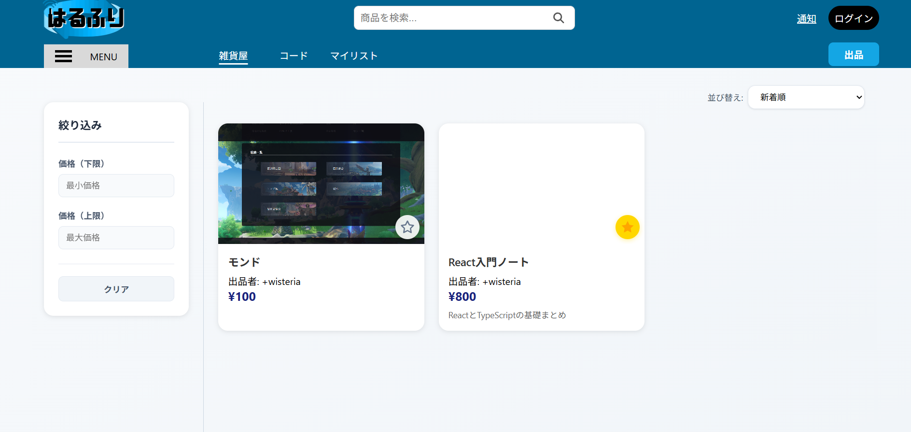
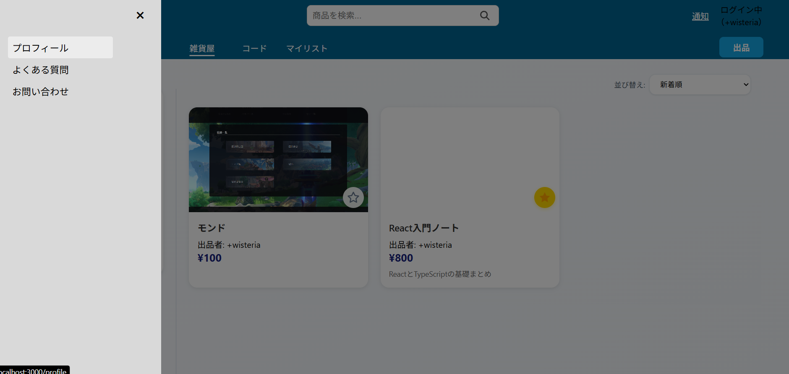
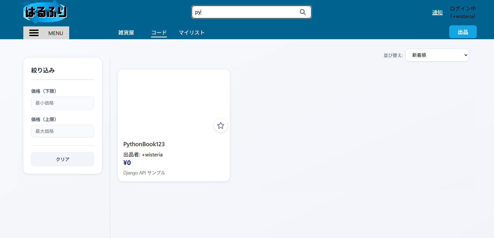
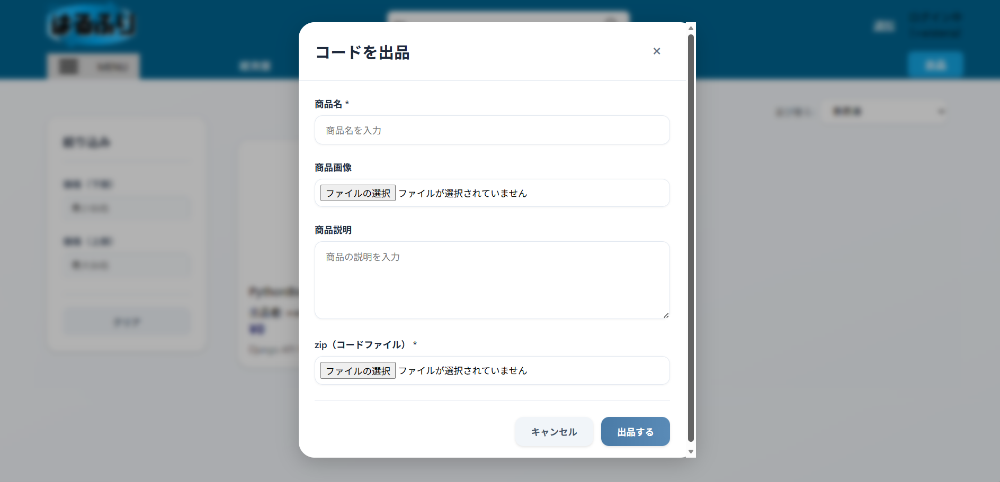
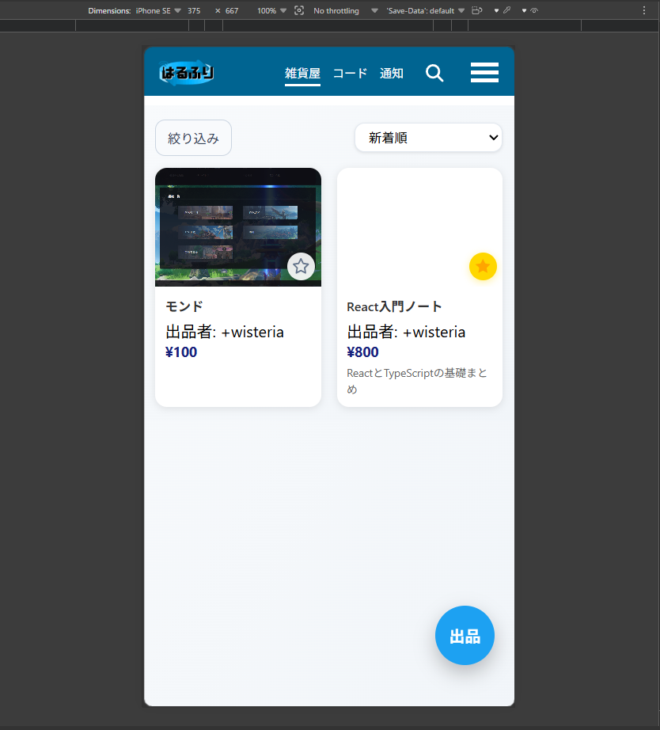

# 学校内専用フリマサイト
二年次の進級制作展に向けてチームで開発した、学校内専用フリマサイトです。 
制作展当日はレンタルサーバーへ公開し、生徒に実際に商品を出品・閲覧してもらいました。

## スクリーンショット

## 主な機能
- 商品一覧表示（カード形式）
- 商品検索
- 商品の並び替え（新着順、価格順、名前順）
- 商品出品（商品名、価格、画像、説明）
- サイドバー（MENU ボタンから開閉、お問い合わせ・よくある質問）

## 使用技術
- React
- TypeScript
- CSS
- Django
- SQLite
- GitHub

## 制作時期
２年次

## 担当
フロントエンド

## 担当内容
- メインページの実装
- レイアウト調整
- MENUボタンから開閉するサイドバーの作成
- コンポーネント統合作業
- 検索機能の不具合修正
- 商品表示切替機能の仮実装
- スマートフォン向けレスポンシブ対応

## 工夫した点
- デザイン担当者が作成したワイヤーフレームを基に実装しました。
- バックエンドへ置き換えやすいよう、コメントを残しながら仮実装を行いました。
- GitHubを用いた共同開発では、更新前にバックアップを作成し、上書きミス発生時の復旧にも対応しました。
- 展示だけでなく実際に利用してもらうことを目的とし、開発終盤にスマートフォン向けレスポンシブ対応を実装しました。

## 公開について
チーム制作物のため、現時点ではソースコードおよび公開URLは掲載していません。 
本READMEでは、担当した範囲と制作内容を紹介しています。
